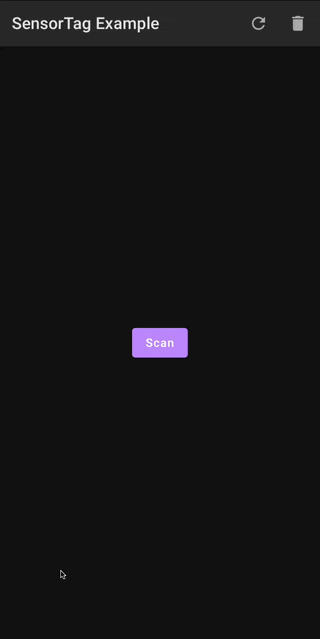

![badge][badge-android]
![badge][badge-js]
![badge][badge-mac]

# SensorTag

Sample app providing connectivity/communication (connects and reads gyroscope) with [SensorTag] devices to demonstrate
capabilities/usage of [Kable] library.

## Android



The Android App can be built and installed via [Android Studio], or via command line by executing:

```
./gradlew installDebug
```

## JavaScript


To build and launch the demo within a browser window, run:

```
./gradlew jsBrowserRun
```

_Web Bluetooth is only available on supported browsers, see [Web Bluetooth API: Browser compatibility] for a list of
supported browsers._

## MacOS

When run, app will launch and immediately scan for nearby [SensorTag] peripherals. The first one found will be connected
to. Once connected, the SensorTag gyro will be subscribed to and printed to console as values arrive.


Console app can be built and run by executing:

<table>
<tr>
<td align="center"><b>Mac CPU</b></td>
<td align="center"><b>Command</b></td>
</tr>

<tr>
<td>Intel</td>
<td>

```bash
./gradlew runDebugExecutableMacosX64
```

</td>
</tr>

<tr>
<td>Apple (e.g. M1)</td>
<td>

```bash
./gradlew runDebugExecutableMacosArm64
```

</td>
</tr>
</table>

# License

```
Copyright 2020 JUUL Labs, Inc.

Licensed under the Apache License, Version 2.0 (the "License");
you may not use this file except in compliance with the License.
You may obtain a copy of the License at

   http://www.apache.org/licenses/LICENSE-2.0

Unless required by applicable law or agreed to in writing, software
distributed under the License is distributed on an "AS IS" BASIS,
WITHOUT WARRANTIES OR CONDITIONS OF ANY KIND, either express or implied.
See the License for the specific language governing permissions and
limitations under the License.
```


[SensorTag]: https://www.ti.com/tool/CC2650STK
[Android Studio]: https://developer.android.com/studio
[Kable]: https://github.com/JuulLabs/kable
[Web Bluetooth API: Browser compatibility]: https://developer.mozilla.org/en-US/docs/Web/API/Web_Bluetooth_API

[badge-android]: http://img.shields.io/badge/platform-android-6EDB8D.svg?style=flat
[badge-ios]: http://img.shields.io/badge/platform-ios-CDCDCD.svg?style=flat
[badge-js]: http://img.shields.io/badge/platform-js-F8DB5D.svg?style=flat
[badge-jvm]: http://img.shields.io/badge/platform-jvm-DB413D.svg?style=flat
[badge-linux]: http://img.shields.io/badge/platform-linux-2D3F6C.svg?style=flat
[badge-windows]: http://img.shields.io/badge/platform-windows-4D76CD.svg?style=flat
[badge-mac]: http://img.shields.io/badge/platform-macos-111111.svg?style=flat
[badge-watchos]: http://img.shields.io/badge/platform-watchos-C0C0C0.svg?style=flat
[badge-tvos]: http://img.shields.io/badge/platform-tvos-808080.svg?style=flat
[badge-wasm]: https://img.shields.io/badge/platform-wasm-624FE8.svg?style=flat
